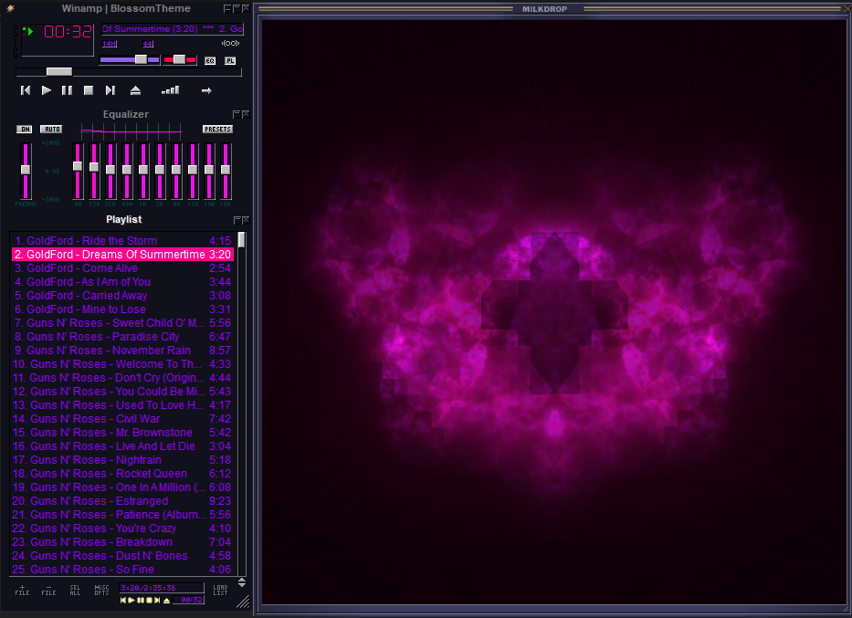
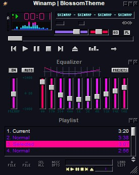
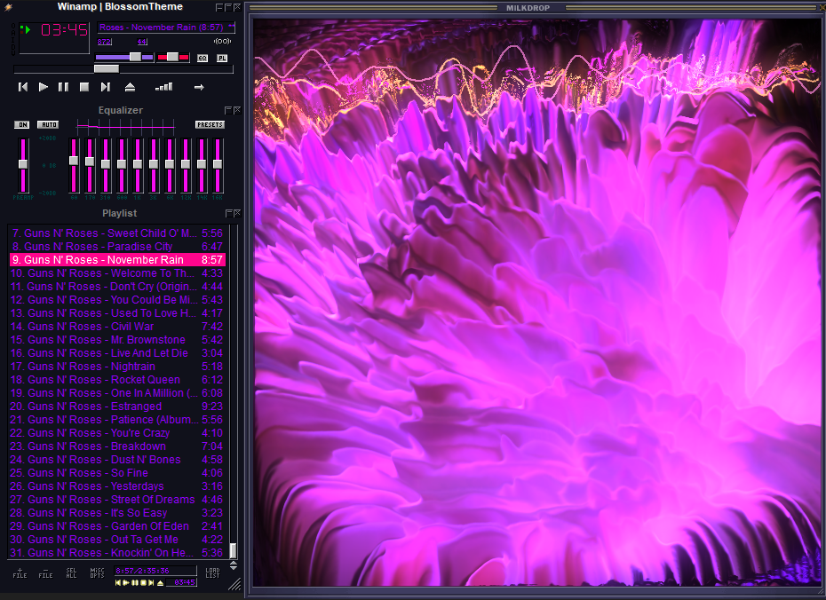
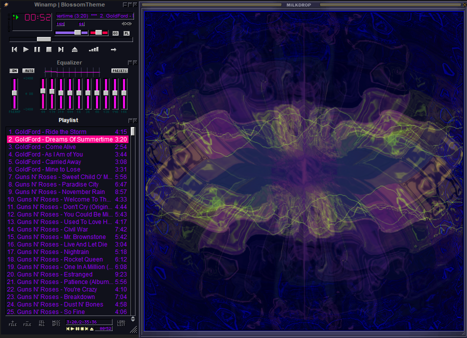

# Blossom Theme for Winamp

## Preview <!---Do not chang headers (Required for WebBuilder)-->








## Installation <!---Do not chang headers (Required for WebBuilder)-->
1. Download the ```Blossom.wsx``` file from the repo.
2. Copy the downloaded file to ```C:\Program Files (x86)\Winamp```.
3. Open Winamp > Right Click Menu > Skins > Blossom.
4. Enjoy!
